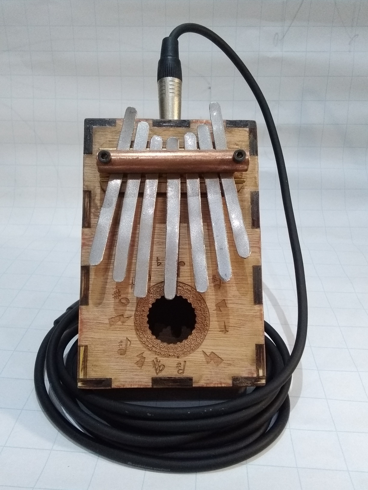

# diy-kalimba

a DIY electro acoustic Kalimba that kinda works

Build instruction on [instructable](https://www.instructables.com/DIY-Electro-Acoustic-Kalimba/)

You'll find here the svg file for lasercutting

<table>
<tr>
 <th scope="col">
 	
 </th>
 <th scope="col">
 	
 </th>
 <th scope="col">
 	
 </th>
</tr>
</table>
